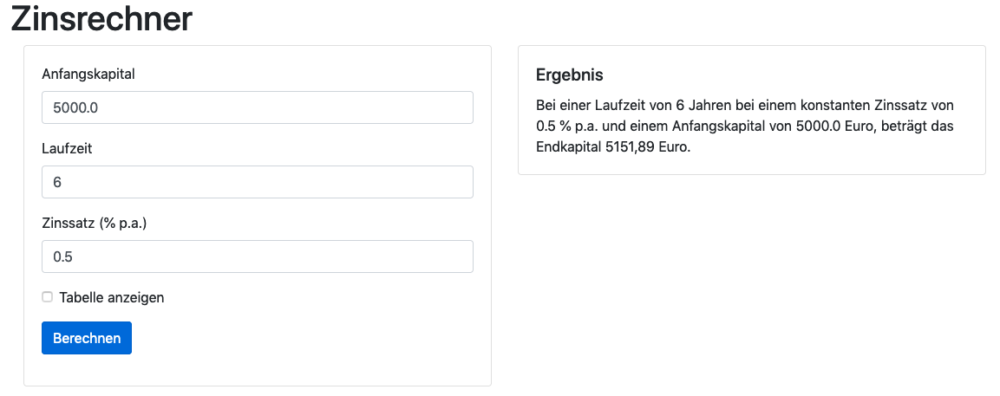

= Softwareentwicklung im Team: Praktische Übung 2
:icons: font
:icon-set: fa
:experimental:
:source-highlighter: rouge
ifdef::env-github[]
:tip-caption: :bulb:
:note-caption: :information_source:
:important-caption: :heavy_exclamation_mark:
:caution-caption: :fire:
:warning-caption: :warning:
:stem: latexmath
endif::[]

== Vorbereitung 

Die Vorbereitungsarbeiten müssen Sie *vor der praktischen Übung* abschließen. 

Wir erwarten von Ihnen, dass Sie 

* ein Headset o. ä. bereithalten und Ihr technisches Setup überprüfen. Die Korrektor:innen verwenden entweder WebEx oder Big Blue Button über https://senfcall.de/ 
* den Aufgabentext unten gelesen und sich dazu schon Gedanken gemacht haben. 
* Wir erwarten von Ihnen, dass Sie verstanden haben, wie Spring Web MVC und Thymeleaf funktioniert. 
* Sie müssen in der Lage sein, die Alkomat Anwendung (Siehe Leitfragen, Wochenblatt 5) selber schreiben zu können. Sie sollten auch verstanden haben, wie Sie bestimmte Teile einer Webseite mit Thymeleaf ein- bzw. ausblenden können. 

== Ziele der Übung

In der Übung sollen Sie eine kleine Webanwendung mit Spring Web MVC implementieren. Sie sollen den Umgang mit Templates und Controllern einüben.  

== Ablauf der Übung

. Schalten Sie *mindestens* das Mikrofon, aber besser auch die Kamera, ein 
. Am Anfang gibt es eine kurze Vorstellungsrunde 
. In der Gruppe wird kurz diskutiert, wie die Lösung angegangen werden soll, und es werden noch offene Fragen geklärt
. Es wird festgelegt, in welcher Reihenfolge die Driver-Rolle übernommen wird
. Die erste Person teilt Ihren Screen und übernimmt mithilfe von `mob` die Session
. Es wird an der Problemstellung gemeinsam nach den Regeln des Mob-Programmings gearbeitet
. Nach ca. der Hälfte der Zeit gibt es ein Feedback durch die Tutorin oder den Tutor
. Es wird weiter an der Problemstellung gearbeitet
. ca. 10 Minuten vor Ende der Session bekommen Sie Ihre Abschlussbewertung 

== Aufgabe

Wir wollen eine Webanwendung implementieren, die den Zinsertrag für einen angelegten Betrag berechnen kann. Dazu soll ein Formular, das in etwa wie folgt aussieht angezeigt werden.

image::z1.png[]

Wenn das Formular abgeschickt wurde, dann soll das Ergebnis berechnet werden und in etwa wie folgt angezeigt werden (jeweils mit und ohne Tabelle)

image::z2.png[]

Die Daten aus der Eingabe sollen immer im Ergebnis auch mit angezeigt werden. 

Die Datei `zinsform.html` enthält den HTML Code der Anwendung. Sie mussen diese Datei noch an die korrekte Stelle verschieben und die Thymeleaf Attribute eingetragen. Ein Teil der HTML Elemente muss auch ausgeblendet werden, z.B. die Tabelle rechts, wenn die Checkbox "Tabelle anzeigen" nicht ausgewählt wurde.